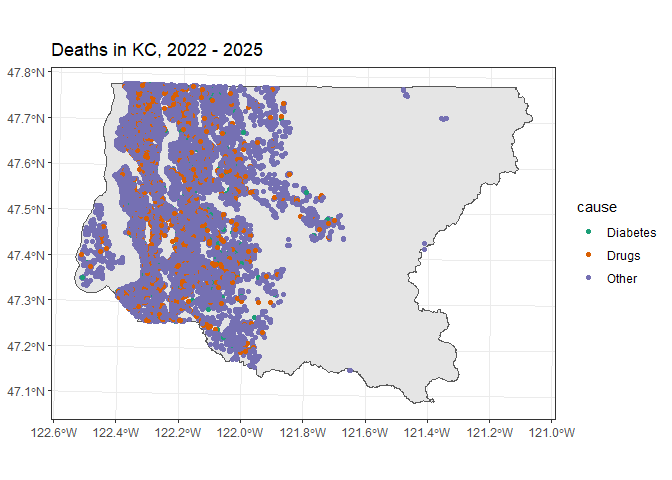
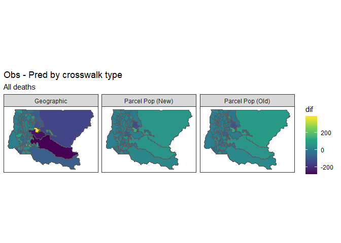

# Compare Parcel Pop Methods


## A ‘real’ data example

Our real data examples will be examining the percent of deaths between
2022 and 2024 that were due to diabetes and the count of deaths due to
all drugs during that period. The source geography will be tracts and
the target geography will be HRAs. Records that are not geocoded within
King County are omitted from the analysis.

## The data

In the extract, there are 44,387 deaths from all causes, 1,337 from
diabetes and 2,454 from all drugs.



## The truth

``` r
# Tract level
tract = st_transform(tract, st_crs(deaths))
dtract = st_join(deaths, tract[,'GEOID'])
dtract = dtract %>% 
  st_drop_geometry() %>% 
  group_by(GEOID) %>%
  summarize(diabetes = sum(diabetes,na.rm =T),
            drugs = sum(all_drugs, na.rm = T),
            all = n())

dtract = dtract %>% mutate(pdiabetes := diabetes/all)

# HRA

dhra = st_join(deaths, hra[,'id']) %>%
  st_drop_geometry() %>%
  group_by(id) %>%
   summarize(diabetes = sum(diabetes,na.rm =T),
            drugs = sum(all_drugs, na.rm = T),
            all = n())%>% 
  mutate(pdiabetes := diabetes/all) %>%
  filter(!is.na(id))
```

## Crosswalks

``` r
new_pp = kcparcelpop::point_pop(2022:2024)
old_pp = read_sf("//dphcifs/APDE-CDIP/Shapefiles/historical_parcel/old_parcel_pop.gpkg")

geog = create_xwalk(tract, hra, 'GEOID', 'id', method = 'fractional overlap')
ppop_new = create_xwalk(tract, hra, 'GEOID', 'id', method = 'point pop', point_pop = new_pp) |>
  filter(isect_amount >0)
ppop_old = create_xwalk(tract, hra, 'GEOID', 'id', method = 'point pop', point_pop = old_pp) |>
  filter(isect_amount >0)


# go from tract to hra
t2hra = function(dtract, xw,  type = 'geog'){
  
  r = lapply(c('diabetes', 'drugs', 'all', 'pdiabetes'), function(x){
    
    d = crosswalk(dtract, 'GEOID', est = x, 
              proportion = x == 'pdiabetes', 
              xwalk_df = xw)
    
    d$var = x
    
    d
    
  })
  
  r = rbindlist(r)
  r = dcast(r, target_id ~ var, value.var = 'est')
  r[, 'type' := type]
  
  r
}

rgeog = t2hra(dtract, geog, 'geog')
rppop_new = t2hra(dtract, ppop_new, 'ppop_new')
rppop_old = t2hra(dtract, ppop_old, 'ppop_old')

rmse = function(obs, pred) round(sqrt(mean((obs - pred)^2)),3)
# compute rmse for stuff
compare_to_truth = function(obs, pred){
  pred = copy(pred)
  setnames(pred, 
           c('diabetes', 'drugs', 'all', 'pdiabetes'),
           c('e_diabetes', 'e_drugs', 'e_all', 'e_pdiabetes')
           )
  
  r = merge(obs, pred, all.x = T, by.x = 'id', by.y = 'target_id')
  setDT(r)
  
  # convert two counts, and then compute
  r[, e_pdiabetes2 := e_diabetes/e_all]
  
  # compute RMSEs
  e = r[, .(all = rmse(all, e_all),
        diabetes = rmse(diabetes, e_diabetes),
        drugs = rmse(drugs, e_drugs),
        pdiabetes = rmse(pdiabetes, e_pdiabetes),
        pdiabetes2 = rmse(pdiabetes, e_pdiabetes2)), type]
  e
  
}

cgeog = compare_to_truth(dhra, rgeog)
cppop_new = compare_to_truth(dhra, rppop_new)
cppop_old = compare_to_truth(dhra, rppop_old)

knitr::kable(rbind(cgeog, cppop_old, cppop_new), label = 'RMSE by variable and approach')
```

| type     |    all | diabetes | drugs | pdiabetes | pdiabetes2 |
|:---------|-------:|---------:|------:|----------:|-----------:|
| geog     | 85.191 |    2.196 | 3.598 |     0.007 |      0.002 |
| ppop_old | 33.986 |    1.534 | 2.356 |     0.003 |      0.002 |
| ppop_new | 34.459 |    1.515 | 2.216 |     0.003 |      0.002 |

As the table shows, parcel population has lower overall error across
most indicators.

``` r
dhra = merge(
  dhra, 
  rgeog[, .(id = target_id, geog_all = all)], all.x = T,
  by = 'id')

dhra = merge(
  dhra,
  rppop_new[, .(id = target_id, ppop_new_all = all)],
  all.x = T,
  by = 'id')

dhra = merge(
  dhra,
  rppop_old[, .(id = target_id, ppop_old_all = all)],
  all.x = T,
  by = 'id')

setDT(dhra)
ghra = melt(dhra[, .(id, all, geog_all, ppop_new_all, ppop_old_all)], id.vars = c('id', 'all'))

ghra[, dif := all - value]
ghra[, variable := factor(variable, c('geog_all', 'ppop_new_all', 'ppop_old_all'), c('Geographic', 'Parcel Pop (New)', 'Parcel Pop (Old)'))]
ghra = merge(ghra, hra[, 'id'], by = 'id')
ghra = st_as_sf(ghra)

ggplot(ghra, aes(fill = dif)) + 
  geom_sf() + 
  facet_wrap(~variable) +
  scale_fill_viridis_c() +
  theme_bw() +
  ggtitle('Obs - Pred by crosswalk type', 'All deaths') +
  theme(axis.text = element_blank(),
        axis.ticks = element_blank(),
        panel.grid = element_blank())
```



This graph shows the difference in the observed number of deaths
relative to the “predicted” number of deaths created via the
crosswalking approaches. In general, the parcel/point population
approach has less “error” than the geographic approach.
